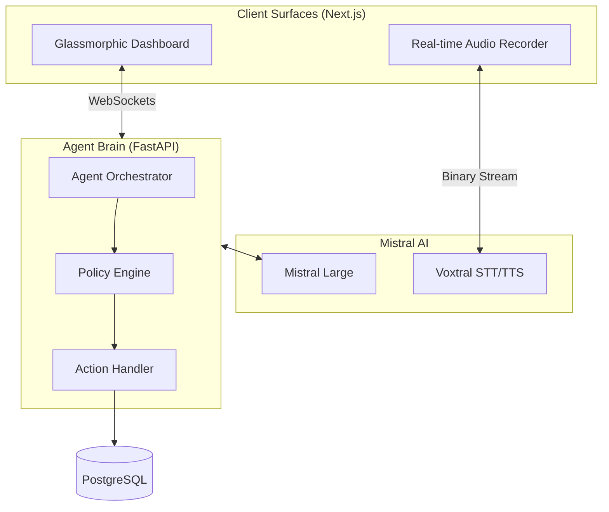

# Mizan — The Autonomous Student Wellbeing Agent
### 🏷️ GIEW 2026: Wellness & Agent Challenge Submission
**Submission Date:** April 14, 2026 | **Version:** 1.0.0 "Eudaimonia"

---

## 🚀 Live Production Access

Mizan is deployed on a high-availability AWS EC2 environment with SSL termination.

*   **User Portal (Mobile/Web):** [https://mizanm.mohamededderyouch.me/](https://mizanm.mohamededderyouch.me/)
*   **Administration Center:** [https://mizan.mohamededderyouch.me/](https://mizan.mohamededderyouch.me/)
*   **Infrastructure API:** [https://api.mohamededderyouch.me/docs](https://api.mohamededderyouch.me/docs)

### 🔑 Evaluation Credentials
| Persona | Email Address | Password |
| :--- | :--- | :--- |
| **Student** | `mohamededderyouch5@gmail.com` | `Simosimo1` |
| **School Administrator** | `admin@mizanmail.local` | `Admin123!` |

---

## 🎯 The Vision: Beyond Binary Productivity
Modern education is experiencing a mental health crisis. Traditional productivity tools treat students as numerical outputs, leading to "over-optimization" and burnout. **Mizan** (Arabic for *Balance*) introduces the concept of the **Digital Sanctuary**—an agentic ecosystem that prioritizes the student's cognitive energy over their to-do list.

Mizan is not a tool; it is an **Autonomous Digital Twin** that acts as a buffer between the student and the academic machine.

---

## 🤖 The Agentic Core (Sense-Think-Decide-Act)

Mizan implements a true autonomous agent loop, leveraging the latest **Mistral AI** models for high-order reasoning and real-time interaction.

### 1️⃣ SENSE: The Sensory Layer
Mizan ingests multi-dimensional data to maintain a real-time state of the student:
*   **Contextual Senses**: Mood scores, sleep cycles, and self-reported stress levels via Morning/Evening rituals.
*   **Academic Senses**: Real-time monitoring of institutional metadata. The agent detects new exams, shifts in project deadlines, and course load density.
*   **Biometric Intent**: Captures vocal stress and sentiment through raw audio streams (WebSockets).

### 2️⃣ THINK: The Reasoning Engine
The "Brain" uses a **ReAct (Reason + Action) Planner** powered by **Mistral-Large**. 
*   **Reflective Logic**: Instead of matching keywords, the agent reflects: *"The user has an exam tomorrow but their mood is 2/5. A standard 'study' nudge will be counter-productive. I must first stabilize their state."*
*   **Deterministic Safety**: If the `AgentPolicyEngine` detects critical stress indicators, it overrides the LLM with hard-coded safety protocols (deterministic fallbacks).

### 3️⃣ DECIDE: Strategic Selection
The Orchestrator chooses from a specialized repertoire of **Agent Actions**:
*   **`PROPOSE_MODE_SWITCH`**: Reconfigures the entire frontend environment (Colors, Focus, Accessibility).
*   **`CREATE_ADAPTIVE_TASK`**: Spawns tasks with adjusted complexity based on the student's cognitive bandwidth.
*   **`AGENT_SYNC`**: Automatically clones institutional schedules to the student's dashboard to ensure absolute data parity without user effort.

### 4️⃣ ACT: System Intervention
The agent executes decisions instantly:
*   **Theme Injection**: Applying glassmorphic "Focus Modes" (Revision, Project, Reset).
*   **Nudge Delivery**: Proactive notifications via WebSockets.
*   **Lifecycle Management**: Cleaning up stale tasks or escalating wellbeing risks to the School Administrator.

---

## 🏗️ Technical Architecture & Stack

Mizan architecture is designed for low latency and high reliability, separating the "Cognitive Brain" from the "Reactive Interface".

### The Stack
*   **AI Engine**: Mistral AI (Large 2, Voxtral-STT, Voxtral-TTS).
*   **Computational Backend**: FastAPI (Python 3.12) - High-concurrency async orchestrator.
*   **Data Persistence**: PostgreSQL 16 (Relational Context) + SQLAlchemy 2.0.
*   **Frontend Ecosystem**: Next.js 14 (App Router), Tailwind CSS, Shadcn UI, Framer Motion.
*   **Real-time Communication**: WebSockets for live voice streaming and instant agent pushes.
*   **Infrastructure**: Docker Compose, AWS EC2, Nginx Reverse Proxy, Certbot SSL.

### Architecture Diagram


---

## 🎭 Deep-Dive Scenarios

### 🌊 Scenario A: Burnout Stabilization
1.  **Sense**: Student logs `Mood: 1/5` for the 3rd consecutive day during the Morning Ritual.
2.  **Think**: Agent identifies "High Exhaustion" + "Major Exam in 2 days".
3.  **Decide**: LLM determines that rest is the only path to success.
4.  **Act**: Mizan forces `RESET` mode, hides the exam countdown to reduce anxiety, and creates a "15-min Meditative Breathing" task.

### 📚 Scenario B: The Institutional Synchronization
1.  **Sense**: School Head adds a new exam to the `Architecture` class.
2.  **Think**: Agent identifies 30 students impacted by this change.
3.  **Decide**: Synchronize personal schedules immediately.
4.  **Act**: The `sync_class_content` service clones the metadata and notifies all students via the PWA.

---

## 🛠️ Execution & Deployment Guide

### Evaluation via Docker
```bash
# 1. Clone & Enter
git clone https://github.com/simoderyouch/Mizan.git && cd Mizan

# 2. Configure Credentials
cp .env.compose.example .env.compose
# Important: Add your MISTRAL_API_KEY in .env.compose

# 3. Spin up the Sanctuary
docker compose --env-file .env.compose up -d --build
```
*   **Frontend**: `http://localhost:3000`
*   **Backend**: `http://localhost:8000/docs`

---

## 🌟 Strategic Impact & Roadmap
*   **Scalability**: Built for institutional-wide deployment (Schools/Universities).
*   **Accessibility**: Full voice-driven interaction for students with visual or motor impairments.
*   **Predictive Analytics**: Future iterations will include "Stress Prediction" using historical wellbeing patterns.

---
*Created with technical excellence and human empathy by Team Mizan.*
