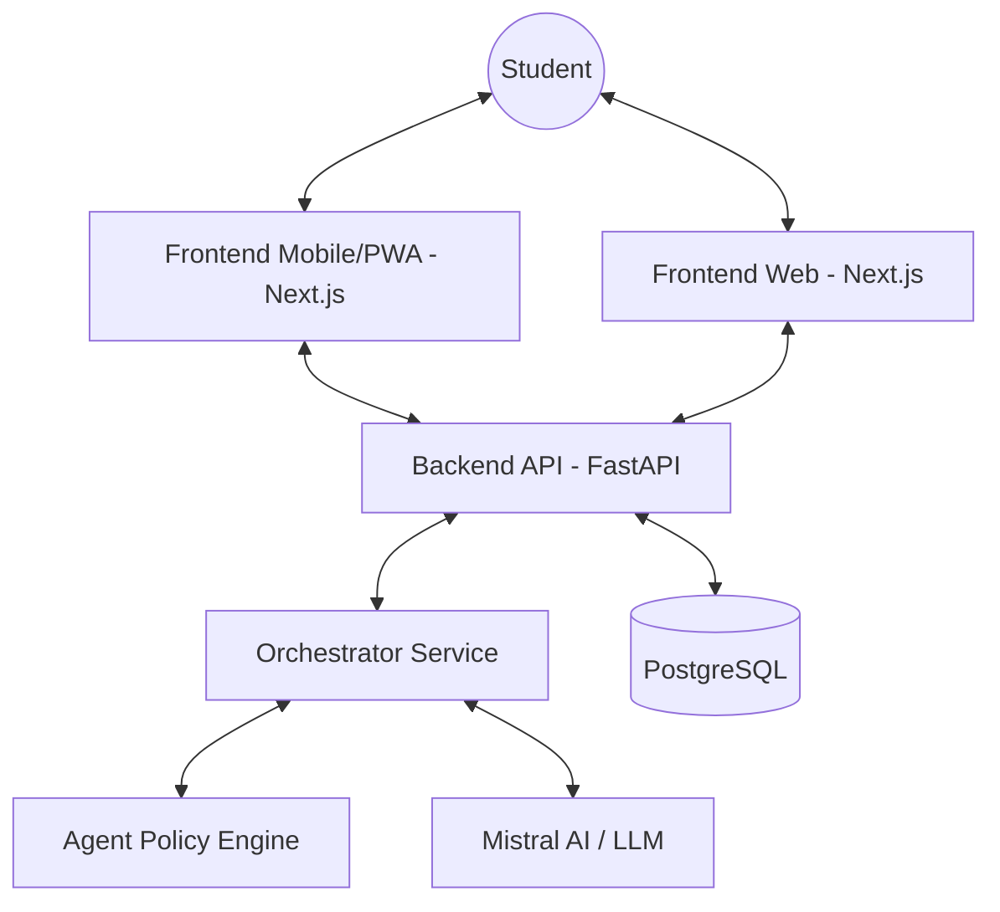

# Mizan: Detailed Technical Documentation

Mizan is a premium, AI-driven "Digital Sanctuary" designed to support student wellbeing and academic success. Unlike traditional productivity tools, Mizan focuses on the intersection of cognitive load, stress, and focused execution, providing a calm, editorial-style interface that adapts to the user's emotional and academic state.

---

## 🚀 Core Functionalities

### 1. Wellbeing Rituals
*   **Morning Check-in**: A structured or conversational ritual to capture sleep, mood, and daily goals. It generates a "Résumé Exécutif" and a suggested action plan.
*   **Evening Reflection**: A moment to decompress, log achievements, and prepare the mind for rest.
*   **Dynamic QCM/Voice**: Rituals can be completed via interactive voice chat or dynamic multiple-choice questions that adapt based on the user's previous context.

### 2. Intelligent Focus Modes (Sanctuary Modes)
Mizan implements a mode-based execution system that transforms the UI (glassmorphism, color palettes) and limits distractions:
*   **REVISION**: Optimized for deep study blocks.
*   **EXAMEN**: High-pressure mode with countdowns and triage-first tasking.
*   **PROJET**: Milestone-focused execution.
*   **REPOS / RESET**: Guided recovery and soft restarts.

### 3. Context-Aware Task Management
*   **Agent-Generated Tasks**: Mizan's brain creates tasks automatically based on rituals or urgent events (e.g., an upcoming exam detected in the schedule).
*   **Action Contracts**: A commitment mechanism where students "commit" to a specific focus block, increasing accountability.
*   **Adaptive Load**: The system reduces suggested task complexity if high stress or low mood is detected.

### 4. AI Voice Companion
*   **Realtime Interaction**: Low-latency voice chat for rituals and mental walkthroughs.
*   **Task Extraction**: The companion listens to study plans and automatically extracts actionable tasks.

---

## 🏗️ System Architecture

### High-Level Overview
Mizan follows a modern client-server architecture with a clear separation between the "Brain" (Backend) and the "Sensors/Interface" (Frontend).

### Components & Interaction
*   **Backend (FastAPI)**:
    *   **Orchestrator**: Monitors "Triggers" (Schedule changes, mood drops, periodic scans).
    *   **Context Builder**: Aggregates student data (mood, tasks, exams, courses) into a rich prompt for the AI.
    *   **Realtime Voice Service**: Handles WebSocket connections for live transcription and TTS synthesis.
*   **Frontend (Next.js 14)**:
    *   **Mobile Ritual UI**: Specialized components for Mood picking, Sleep input, and QCM interaction.
    *   **Mode Controller**: Manages the global visual state and "Digital Sanctuary" aesthetic.
*   **Communication Layer**:
    *   **REST API**: For standard CRUD operations and authentication.
    *   **WebSockets**: For realtime voice interaction and instantaneous notifications.

---

## 🤖 AI & Agent Concepts

### 1. The "Background Brain" Agent
The core agent (Mizan) operates as an **Autonomous Orchestrator**. It doesn't just wait for user input; it reacts to:
*   **Metadata Updates**: New exams or project deadlines imported into the system.
*   **Periodic Scans**: Scheduled checks of the student's wellbeing "trajectory."
*   **Silence Risk**: Detecting when a student skips a critical ritual on a high-load day.

### 2. Decision Logic: ReAct & Deterministic Fallbacks
Mizan uses a hybrid intelligence model:
*   **LLM Planner (Mistral)**: Uses a ReAct-style prompt to think through complex wellbeing scenarios and suggest nuanced actions (e.g., "Student is tired but has an exam, suggest a 20-min micro-sprint").
*   **Agent Policy Engine**: A set of hard-coded "Safety Rules" that take precedence in critical situations (e.g., if mood is low for 3+ days, ignore LLM and force a "Recovery Mode" suggestion).

### 3. Voice Realtime concepts
*   **STT (Speech-to-Text)**: Realtime PCM stream processing via WebSockets using Mistral's transcription models.
*   **TTS (Text-to-Speech)**: High-quality neural voice synthesis with frontend audio enhancement (Gain/Compression).

---

## 🎭 User Scenarios

### Scenario A: The Exam Pressure
1.  **Trigger**: User imports a new Exam schedule.
2.  **Agent Action**: The Orchestrator detects the exam is tomorrow and the user hasn't logged a revision session.
3.  **Result**: User receive a "Mode Switch" notification proposing `EXAMEN` mode and creates a "Triage Sprint" task.

### Scenario B: Burnout Prevention
1.  **Trigger**: Morning check-in logs a mood of 2/5 for the 3rd consecutive day.
2.  **Agent Action**: The Policy Engine triggers an `ESCALATE_WELLBEING` action.
3.  **Result**: The UI suggests a `REPOS` mode, hides non-essential tasks, and nudges the user toward a specific wellbeing resource.

### Scenario C: The Morning Reset
1.  **Trigger**: Student opens the app at 8:00 AM.
2.  **Interaction**: Student talks to the Voice Companion about their anxiety regarding a project.
3.  **Result**: The AI extracts 3 concrete tasks, confirms them with the user, and transitions the app into `PROJET` mode.

---

## 🛠️ Technology Stack

| Layer | Technologies |
| :--- | :--- |
| **Frontend** | Next.js 14 (App Router), Tailwind CSS, Shadcn UI, Framer Motion, Lucide Icons |
| **Backend** | FastAPI, Python 3.11+, SQLAlchemy (Async), Pydantic v2 |
| **AI / ML** | Mistral AI (Mistral Large, Voxtral Mini), Whisper-based STT |
| **Database** | PostgreSQL 16 |
| **Infra/DevOps** | Docker, Docker Compose, Alembic (Migrations) |
| **Communication** | REST API, WebSockets (Realtime Audio) |

---

## 📖 Component Communication Flow
1.  **Data Ingestion**: Student's activity or periodic scan triggers the `AgentOrchestrator`.
2.  **Context Assembly**: `ContextBuilder` fetches latest mood history, pending tasks, and academic pressure.
3.  **Inference**: The `AgentOrchestrator` calls Mistral/Mistral-TTS to decide on an action.
4.  **Reaction**: The `NotificationService` sends a nudge, or the `TaskService` creates an "Agent Task."
5.  **UI Update**: The Frontend reflects the change via Realtime notifications or a Mode Switch suggestion.
